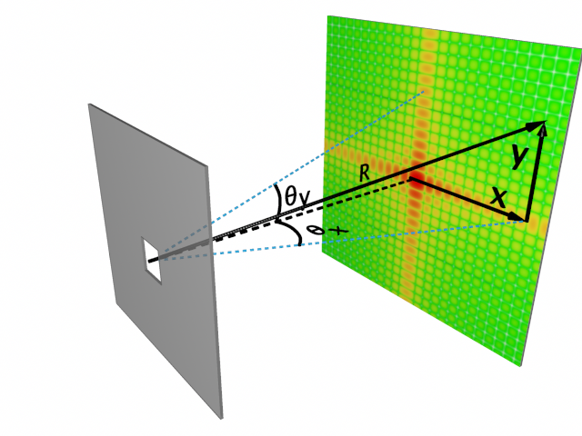

# TP5

## Introduction

Vous êtes maintenant en charge du *Canadian Omni-Wave Illumination Diffractometer* (le COVID), un appareil puisssant qui utilise la diffraction pour caractériser des échantillons. Pour bien prédire les résultats, il est nécessaire de faire la simulation de faisceaux réels. Vous devez donc calculer le patron de diffraction en champ électrique en tout plan perpendiculaire à la direction de propagation, autant dans le champ proche que dans le champ lointain, et en 2D en plus.

Vous avez le code d'un stagiaire qui l'a fait heureusement en Python mais malheureusement en 1D. Le code est disponible [ici](https://github.com/dccote/Diffraction/tree/master/Python) à https://github.com/dccote/Diffraction/tree/master/Python/diffraction1D.py. Regardez ce code, très incomplet: nous voulons maintenant une version efficace en 2D car nous ferons énormément de calculs pour des faisceaux arbitraires.

Si vous avez besoin de rafraichir vos notions d'optique sur la diffraction, le cours d'optique PHY-2004/GPH-2005 est en ligne [ici](https://www.youtube.com/playlist?list=PLUxTghemi4FtyB41b-ApiPYV-CfbgT8Zj) à https://www.youtube.com/playlist?list=PLUxTghemi4FtyB41b-ApiPYV-CfbgT8Zj et les diapositives sont aussi disponibles sur le Web.

## Première itération

### La référence

Refaites en 2D en vous inspirant du code 1D une version de référence avec Huygens-Fresnel.  En effet, en utilisant le principe de Huygens-Fresnel, nous ne faisons absolument aucune approximation, donc le calcul est 100% valide en tout point:
$$
{\bf E}_\sigma({\bf r})  \approx \int {\bf E}_\Sigma({\bf r^\prime})\frac{e^{i k |{\bf r-r^\prime}|}}{|{\bf r-r^\prime}|}  d{\bf r^\prime}.
$$
Comme point de départ, nous vous donnons `Field2D.py` (le code est à la fin) pour gérer un champ en 2D. **Implémentez cette méthode en 2D dans la classe Field2D**:

```python
def propagate(self, distance:float) # Modifie le champ directement
```

  Bien que triviale à coder, vous verrez: elle est ***extrêmement lente*** à moins que le calcul n'inclut que très peu de points.

### Validation

Évidemment, vous devez valider ce que vous calculez: n'importe qui peut obtenir des chiffres et des beaux graphiques. Montrez que le faisceau gaussien partant de son point d'étranglement voit sa taille $w(z)$, définie en 1/e en champ électrique, suivre la règle suivante:

$$
w(z) = w_\circ \sqrt{1+\left(\frac{z}{z_\circ}\right)^2},
$$
avec $z_\circ = \pi w_\circ^2/\lambda$. 

### Calculs

1. Montrez que votre code de propagation suit cette règle.
2. Faites les calculs suivants: un obstacle carré de dimension 1 et 100 longueurs d'onde, à une distance de 1 mm et 1000 mm, illuminé par une onde plane.

## Deuxième version

Nous voulons la diffraction en tout point, mais nous allons commencer par la version Fraunhofer, qui est très simple:  
$$
E_{\sigma}(\sin\theta_x,\sin\theta_y ) \approx \frac{{{e^{i{kR}}}}}{R}\int\int {E_\Sigma(x^\prime,y^\prime){e^{ - ik x^\prime \sin \theta_x - ik y^\prime \sin \theta_y}}dx^\prime dy^\prime}
$$


### Calculs

1. Implémentez cette version de `propagationFraunhofer` sans les transformées de Fourier
2. Montrez que le calcul est plus rapide que la version de référence
3. Montrez que la version de Fraunhofer est la version Huygens-Fresnel pour les grandes distances. Vérifiez que le critère de Fraunhofer est respecté.
4. Obtenez un graphique **étalonné** pour le patron de diffraction d'un cercle de 5 microns de diamètre, à une longueur d'onde de 1 µm à 1 mm et 1000 mm.

## Troisième version: Fresnel


## Lentille: une phase quadratique

### Calculs

1. Programmez une lentille mince de diamètre $D$ et de distance focale $f$ comme un masque de phase quadratique avec la distance au centre de l'axe optique.
2. Validez que le point focal trace une fonction d'Airy et qu'il est de la grandeur prévue par les notions d'optique, c'est-a-dire essentiellement $ 1.22 f_{\#} \lambda$.

## Question bonus

Les billets de banque canadiens ont tous un hologramme qui diffracte en donnant la valeur nominative du billet. Plus d'information ici. Obtenez un masque de phase qui pourrait être sur un billet de 20 dollars. 


# Annexe

Pour vous faciliter la vie, une classe `Field2D` a été définie.  Elle conserve le champ électrique et l'étalonnage en `dx`

```python
from numpy import *
from matplotlib import pyplot as plt
from PIL import Image

I = complex(0,1)
class Field2D:
    def __init__(self, ds:float, wavelength=float, N:int = None, array2D:ndarray = None):
        self.dx = ds
        self.dy = ds
        self.wavelength= wavelength
        if array2D is None and N is not None:
            self.values = zeros((N, N),dtype=cdouble)
        elif array2D is not None and N is None:
            if array2D.dtype != cdouble:
                raise ValueError("Array must be complex")
            self.values = array2D
        else:
            raise ValueError("You must provide either the number of points N or an array")

    def __eq__(self, rhs):
        self.values = rhs.values
        self.dx = rhs.dx
        self.dy = rhs.dy

    @property
    def x(self) -> float:
        (N,dummy) = self.values.shape
        return self.dx*linspace(-N/2, N/2, num=N, endpoint=False)

    @property
    def y(self) -> float:
        (dummy,N) = self.values.shape
        return self.dy*linspace(-N/2, N/2, num=N, endpoint=False)

    def showIntensity(self):
        plt.imshow( Image.fromarray(real(self.values*conjugate(self.values))))
        plt.show()

    def showField(self):
        plt.imshow(Image.fromarray(abs(self.values)))
        plt.show()

    def showPhase(self):
        plt.imshow(Image.fromarray(angle(self.values)))
        plt.show()

    def propagate(self, distance:float):
        raise Error("Not Implemented")

    @classmethod
    def Gaussian(self, ds:float, N:int, width:float, wavelength:float, amplitude:float = 1.0):
        allXs = ds*linspace(-N/2, N/2, num=N, endpoint=False)
        allYs = ds*linspace(-N/2, N/2, num=N, endpoint=False)

        values = zeros((N, N),dtype=cdouble)
        for (i,x) in enumerate(allXs):
            for (j,y) in enumerate(allYs):
                values[i,j] = amplitude*exp(-(x*x+y*y)/(width*width))
        return Field2D(array2D=values, ds=ds, wavelength=wavelength)


if __name__ == "__main__":
    f = Field2D.Gaussian(width=10, amplitude=16.0, ds=0.1, N=1024, wavelength=0.632)
    f.showIntensity()
    f.showPhase()
    f.showField()
```


```python
import matplotlib
import matplotlib.pyplot as plt
from matplotlib.colors import BoundaryNorm
from matplotlib.ticker import MaxNLocator
from numpy import *
import numpy as np

I = complex(0,1)

def diffraction(sCoords, sAmplitudes, k, r, screenCoords, progressMessage="Computing diffraction"):
    """ This is the core of the diffraction code.  Yes it is.
    sum all spherical waves of amplitude A from the source at sCoords
    on the screen at yCoords. Done. """

    if len(sCoords) != len(sAmplitudes):
        raise ValueError("Array not same size coords={0:d}, amplitude={1:d}".format(len(sCoords), len(sAmplitudes)))

    Efield=[0]*len(screenCoords) # Initialize with no field for a given r
    for j,y_source in enumerate(sCoords):
        A = sAmplitudes[j]
        reportProgress(j,len(sCoords), progressMessage)
        for i,y_screen in enumerate(screenCoords):
            Ro = sqrt( (y_screen-y_source)**2 + r**2)
            # we don't divide by r because we keep everything normalized
            Efield[i] += A * exp(-I*k*Ro) 

    return Efield

def createFigure():
    fig, axes = plt.subplots(figsize=(10, 7))
    axes.set(xlabel='Distance', ylabel='Intensite')
    axes.set_title("Profil de Diffraction")
    return fig, axes

def showDiffractedIntensity(screenCoordinates, Efields, envelope=None, title="", comment=""):
    fig, axes = createFigure()

    for Efield in Efields:
        axes.plot(screenCoordinates, abs(Efield*conjugate(Efield)), linewidth=1,label="Diffracted beam")

    if envelope is not None:
        axes.plot(screenCoordinates, envelope, linestyle=":", linewidth=1,label="Envelope")

    axes.set(xlabel='Position [µm]', ylabel='Intensite')
    axes.set_title(title, ha='center',size=13)
    axes.text(0.05,0.95, comment, size=10, va='top', bbox=dict(boxstyle="square", fc='w',ec='k', lw=1,ls=":"), transform=axes.transAxes)
    plt.show()


def reportProgress(i, N, label=""):
    """ i goes from 0 to N-1 """
    tenPercent = int(N/10)
    percent = int((i+1)*100/N)
    if i % tenPercent == 0:
        print("{0} {1:.0f}%".format(label, percent))


def sourceSingleSlitOpaqueWall(a, da):
    """ We return two lists: one with the space coordinates, one with the 
    amplitude at the corresponding coordinate. 
    Amplitude is zero outside of coordinates from aCoords. """

    Na = int(a/da)
    amplitude = (1/float(Na)) # normalized

    aCoords = [(j-Na/2)*da for j in range(Na+1)] # space coordinates
    amplitudes = [ amplitude for y in aCoords] # constant amplitude

    return (aCoords, amplitudes)

def sourcePeriodicSlitOpaqueWall(aCoords, amplitudes, b, Nb):
    """ We repeat the provided amplitudes, every 'b' distance, Nb times.  This is
    therefore a "grating" """

    bCoords = [(j-Nb/2)*b for j in range(Nb)]

    gCoords = []
    gratingAmplitudes = []
    for x in bCoords:
        gCoords.extend([ x+y for y in aCoords])
        gratingAmplitudes.extend( [(A/Nb) for A in amplitudes] )

    return (gCoords, gratingAmplitudes)

def sourceSingleSlitWithLinearPhaseOpaqueWall(a, da, minPhase, maxPhase):
    """ We return the coordinates and amplitude of a single slit with a linear phase from
    minPhase (at x = 0) to maxPhase (at x = a).
    """
    (aCoords, amplitudes) = sourceSingleSlitOpaqueWall(a, da)

    phaseSlope = (maxPhase - minPhase)
    phaseIntercept = minPhase - phaseSlope*aCoords[0] # We want minPhase at aCoords[0]
    phaseMask = [ exp(-I * (phaseSlope*x + phaseIntercept) ) for x in aCoords] 
    maskedAmplitudes = np.multiply(amplitudes, phaseMask)

    return (aCoords, maskedAmplitudes)


if __name__ == "__main__":
    """ This code computes the diffraction pattern in the simplest way possible:
    by adding spherical ways from the diffraction objstacle. It is extremely
    inefficient and slow, but it is trivial to understand. """

    wavelength = 1
    k = 2*pi/wavelength


    # Common definition: Distance to screen
    R = 12000 # Distance source-screen in µm

    # Common definition: We calculate on a screen of size Y
    Y = 12000
    dY = 10
    Ny = int(Y/dY)
    screenCoords = [(j-(Ny-1)/2)*dY for j in range(Ny)]

    # First example: single slit
    a = 5
    da = 0.1
    (aCoords, amplitudes) = sourceSingleSlitOpaqueWall(a=5, da=0.1)
    Efield = diffraction(aCoords, amplitudes, k, R, screenCoords, progressMessage="Calcul fente simple")
    showDiffractedIntensity(screenCoords, [Efield],title="Figure: Profil à R={0} mm d'une fente de largeur a={1} µm".format(R/1000,a))
    envelope = abs(Efield*conjugate(Efield))

    # Second example: 2 slits separated by small distance (b-a)
    (aCoords, amplitudes) = sourceSingleSlitOpaqueWall(a=5, da=0.1)
    b = 10
    Nb = 2
    (gratingCoords, gratingAmplitudes) = sourcePeriodicSlitOpaqueWall(aCoords, amplitudes, b=b, Nb=Nb)
    Efield = diffraction(gratingCoords, gratingAmplitudes, k, R, screenCoords, progressMessage="Calcul fente double")
    showDiffractedIntensity( screenCoords, [Efield], envelope=envelope, 
        title="Figure: Profil à R={0} mm de 2 fentes de largeur a=5 µm séparées par {1:d} µm".format(R/1000, b-a),
        comment="Notez l'interference entre les {0} fentes\net l'enveloppe générale correspondant\nà une seule fente".format(Nb))

    # Third example: 10 slits separated by small distance (b-a)
    (aCoords, amplitudes) = sourceSingleSlitOpaqueWall(a=a, da=da)
    b = 10
    Nb = 10
    (gratingCoords, gratingAmplitudes) = sourcePeriodicSlitOpaqueWall(aCoords, amplitudes, b=b, Nb=Nb)
    Efield = diffraction(gratingCoords, gratingAmplitudes, k, R, screenCoords, progressMessage="Calcul {0} fentes".format(Nb))
    showDiffractedIntensity(screenCoords, [Efield], envelope=envelope, 
        title="Figure: Profil à R={0} mm de 10 fentes de largeur a=5 µm séparées par {1:d} µm".format(R/1000, b-a),
        comment="Notez l'interference plus mince entre\nles {0} fentes encore sous l'enveloppe\ngénérale correspondant à une\nseule fente".format(Nb))

    # Fourth example: single slit with a linear phase mask from minPhase to maxPhase
    d = 0.2
    n = 1.5
    minPhase=k*d
    maxPhase=k*d*n
    (aCoords, amplitudes) = sourceSingleSlitWithLinearPhaseOpaqueWall(a=a, da=da, minPhase=minPhase, maxPhase=maxPhase)
    Efield = diffraction(aCoords, amplitudes, k, R, screenCoords, progressMessage="Calcul fente simple avec masque")
    showDiffractedIntensity(screenCoords, [Efield],
        title="Figure: Profil à R={0} mm d'une fente de largeur a=5 µm\navec un masque de phase lineaire de {1:0.2f} rad à {2:0.2f} rad".format(R/1000, minPhase, maxPhase),
        comment="Notez le déplacement vers la droite\ndu patron de diffraction, dû à la phase\nlinéaire sur la fente")

    # Fifth example: grating of slits from #4 with a linear phase mask from minPhase to maxPhase
    (aCoords, amplitudes) = sourceSingleSlitWithLinearPhaseOpaqueWall(a=a, da=da, minPhase=minPhase, maxPhase=maxPhase)
    (gratingCoords, gratingAmplitudes) = sourcePeriodicSlitOpaqueWall(aCoords, amplitudes, b=10, Nb=5)
    envelope = abs(Efield*conjugate(Efield)) # The field from example #4 gives us the envelope
    Efield = diffraction(gratingCoords, gratingAmplitudes, k, R, screenCoords, progressMessage="Calcul reseau de fentes simples avec masque")
    showDiffractedIntensity(screenCoords, [Efield], envelope=envelope, 
        title="Figure: Profil à R={0} mm de 10 fentes de largeur a=5 µm\navec un masque de phase lineaire de {1:0.2f} rad à {2:0.2f} rad".format(R/1000, minPhase, maxPhase),
        comment="Notez le déplacement vers la droite\ndu patron de diffraction, dû à la phase\nlinéaire sur chaque fente. Maintenant,\nl'ordre 1 est maximum plutôt que l'ordre 0.")

    # Sixth example: single slit, but in Fresnel zone (very close!)
    (aCoords, amplitudes) = sourceSingleSlitOpaqueWall(a, da)
    Rclose = 10
    screenCoordsClose = [(j-(Ny-1)/2)*dY/200 for j in range(Ny)]
    Efield = diffraction(aCoords, amplitudes, k, Rclose, screenCoordsClose, progressMessage="Calcul fente simple, zone de Fresnel")
    showDiffractedIntensity(screenCoordsClose, [Efield],
        title="Figure: Profil dans le regime de Fresnel à R={0} µm d'une fente de largeur a={1} µm".format(Rclose,a),
        comment="Le patron de diffraction d'une fente\nrectangulaire n'est pas un sinc(x)\ndans le champ proche.")

    # Seventh example: single slit diffraction regime from fresnel (very close) to fraunhofer (very far)
    rCoords = [2,5,10,20,50,100]
    screenCoordsClose = [(j-Ny/2)*dY/60 for j in range(Ny)]
    fig, axes = createFigure()
    for idx,r in enumerate(rCoords):
        Efield = diffraction(aCoords, amplitudes, k, r, screenCoordsClose, progressMessage="Calculating single slit at distance r={0}".format(r))
        axes.plot(screenCoordsClose, abs(Efield*conjugate(Efield)), linewidth=1, label="Intensité à r={0}".format(r))
    axes.set(xlabel='Distance', ylabel='Intensite')
    axes.set_title("Figure: Transition de Fresnel a Fraunhofer", ha='center',size=13)
    axes.legend()
    plt.show()


    # Eighth example: 10 slits separated by small distance (b-a), multiple wavelengths
    (aCoords, amplitudes) = sourceSingleSlitOpaqueWall(a=a, da=da)
    b = 10
    Nb = 10
    R = 12000
    (gratingCoords, gratingAmplitudes) = sourcePeriodicSlitOpaqueWall(aCoords, amplitudes, b=b, Nb=Nb)
    Efield1 = diffraction(gratingCoords, gratingAmplitudes, 2*pi/1, R, screenCoords, progressMessage="Calcul {0} fentes".format(Nb))
    Efield2 = diffraction(gratingCoords, gratingAmplitudes, 2*pi/1.1, R, screenCoords, progressMessage="Calcul {0} fentes".format(Nb))
    Efield3 = diffraction(gratingCoords, gratingAmplitudes, 2*pi/1.2, R, screenCoords, progressMessage="Calcul {0} fentes".format(Nb))
    showDiffractedIntensity(screenCoords, [Efield1, Efield2, Efield3], 
        title="Figure: Profils à différentes longueurs d'onde, fente de a=5 µm séparées par {1:d} µm".format(R/1000, b-a),
        comment="Notez qu'à l'ordre 0, il y a superposition.\nÀ l'ordre 1, il y a séparation des couleurs.".format(Nb))

```

