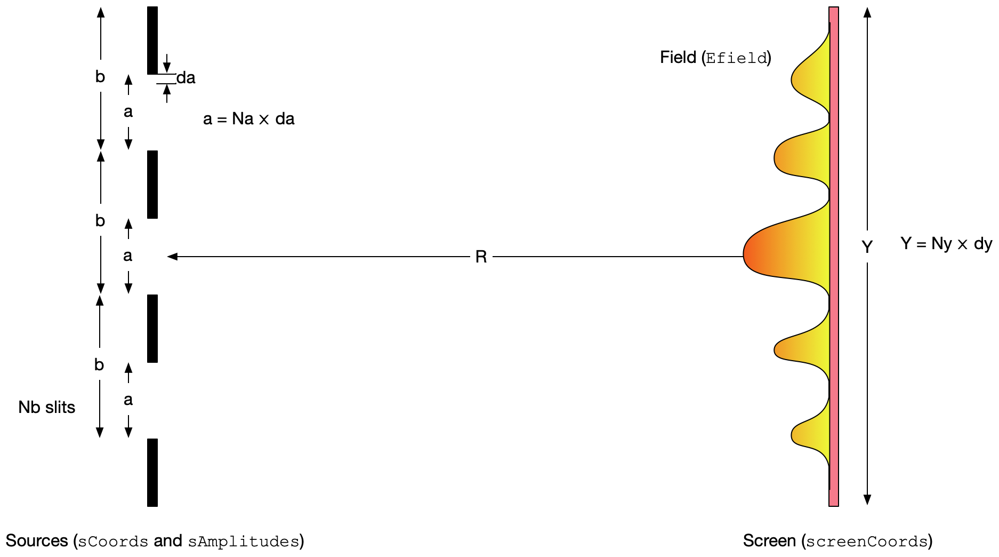

# Diffraction

Vous trouverez dans ces deux repertoires du code pour calculer la diffraction: un pour MATLAB, un en Python.

## Python et diffraction

Le code Python est particulièrement simple: une somme d'onde sphérique, sur une ou plusieurs fentes de largeur $a$, séparées par une distance $b$. On conserve les coordonnées  et les amplitudes des sources dans deux listes séparées: `sCoords` (la position y) et `sAmplitudes` (l'amplitude complexe).  On regarde sur un écran à une distance $r$, avec les coordonnées `screenCoords`. C'est tout. Voici le code dans toute sa splendeur:

```python
def diffraction(sCoords, sAmplitudes, k, r, screenCoords, progressMessage):
    Efield=[0]*len(screenCoords) # Initialize with no field for a given r
    for j,y_source in enumerate(sCoords):
        A = sAmplitudes[j]
        reportProgress(j,len(sCoords), progressMessage)
        for i,y_screen in enumerate(screenCoords):
            Ro = sqrt( (y_screen-y_source)**2 + r**2)
            # we don't divide by r because we keep everything normalized
            Efield[i] += A * exp(-I*k*Ro) 

    return Efield
```



Le code est d'une lenteur à faire peur. Une version qui fait appel aux transformées de Fourier discrètes sera essentiellement instantanée. 


## MATLAB

Ce code MATLAB extrêmement simple permet de visualiser la diffraction d'une fente carrée, circulaire ou arbitraire.

Trois choix de fentes: carrée, circulaire, abritraire.
Trois "sliders": zoom in/out de l'image, intensité (pour mieux voir le contraste quitte à saturer) et grosseur de l'objet.

### Utilisation
1) Téléchargez le code ici en cliquant sur le bouton vert Clone or Download, ensuite Download zip.
2) Ouvrir MATLAB
3) Aller dans le repertoire où le code a été décompressé
4) tapez guiDiffraction dans la console MATLAB

### Plan général pour le code
1) Ajouter les échelles d'espace au niveau de la fente et du patron de diffraction
2) Corriger l'interface qui a l'air d'avoir été fait par mon fils (Luc, 4 ans).
3) Changer le lookup table pour avoir les images en spectrum
4) Permettre de charger n'importe quel image, pas juste mon image arbitraire.
5) Cotinuer le Unit Testing, qui est en cours de developpement.
6) Completement refactoriser le code: sera fait après l'ajout du Unit Testing.
7) Peut-etre en faire une version Python, puisque tout le monde utilise Python maintenant.

